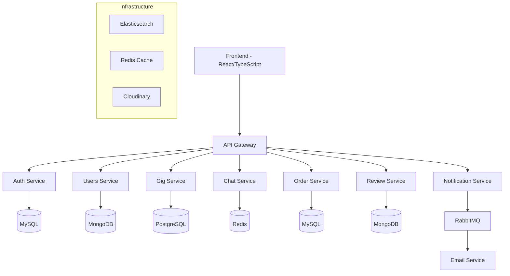

# JobberApp 🛠️

[](LICENSE)
[](https://nodejs.org/)
[](https://reactjs.org/)
[](https://www.typescriptlang.org/)

A modern, scalable freelance marketplace platform built with microservices architecture, featuring real-time chat, secure payments, and comprehensive user management.

## 🌟 Features

- **User Authentication & Authorization**: Secure login/signup with JWT tokens
- **Gig Marketplace**: Sellers can create and manage service listings
- **Real-time Chat**: Instant messaging between buyers and sellers
- **Order Management**: Complete order lifecycle with extensions and disputes
- **Payment Integration**: Stripe-powered secure transactions
- **Review System**: Rating and feedback for completed services
- **Notification System**: Email notifications for all key events
- **Seller Dashboard**: Comprehensive analytics and management tools
- **Buyer Dashboard**: Order tracking and service discovery
- **Admin Panel**: Platform management and moderation
- **Responsive Design**: Mobile-first approach with Tailwind CSS

## 🏗️ Architecture

JobberApp follows a microservices architecture deployed on Kubernetes:



### Services Overview

1. **API Gateway**: Entry point for all client requests, handles routing and authentication
2. **Auth Service**: User authentication, registration, and token management
3. **Users Service**: User profiles, buyer/seller management
4. **Gig Service**: Service listings, categories, and search
5. **Chat Service**: Real-time messaging and file sharing
6. **Order Service**: Order processing, payments, and lifecycle management
7. **Review Service**: Ratings, feedback, and reputation system
8. **Notification Service**: Email and push notifications

## 🛠️ Tech Stack

### Frontend
- **React 18** - Modern UI framework
- **TypeScript** - Type-safe JavaScript
- **Vite** - Fast build tool and dev server
- **Tailwind CSS** - Utility-first CSS framework
- **Redux Toolkit** - State management
- **React Router** - Client-side routing
- **Socket.io** - Real-time communication
- **Stripe** - Payment processing
- **Elastic APM** - Application monitoring

### Backend
- **Node.js** - Runtime environment
- **TypeScript** - Type-safe JavaScript
- **Express.js** - Web framework
- **PM2** - Process manager
- **JWT** - Authentication tokens
- **Winston** - Logging
- **Pino** - High-performance logging

### Databases
- **MySQL** - Relational data (auth, orders)
- **MongoDB** - Document data (users, reviews)
- **PostgreSQL** - Advanced relational features (gigs)
- **Redis** - Caching and session storage
- **Elasticsearch** - Search and analytics

### Infrastructure
- **Docker** - Containerization
- **Kubernetes** - Container orchestration
- **RabbitMQ** - Message queuing
- **Cloudinary** - Media storage
- **AWS EKS** - Production deployment
- **Minikube** - Local development

## 🚀 Installation

### Prerequisites
- Node.js 18+
- Docker & Docker Compose
- Kubernetes (kubectl)
- Minikube (for local development)

### Local Development Setup

1. **Clone the repository**
   ```bash
   git clone https://github.com/uzochukwueddie/jobberapp.git
   cd jobberapp
   ```

2. **Install dependencies**
   ```bash
   # Frontend
   cd jobber-client
   npm install

   # Backend services
   cd ../microservices
   # Install dependencies for each service
   for service in */; do
     if [ -d "$service" ]; then
       cd "$service"
       npm install
       cd ..
     fi
   done
   ```

3. **Environment Configuration**
   ```bash
   # Copy environment files
   cp microservices/1-gateway-service/.env.example microservices/1-gateway-service/.env.dev
   # Configure database connections, API keys, etc.
   ```

4. **Start Services**
   ```bash
   # Using Docker Compose (if available)
   docker-compose up -d

   # Or start individually
   cd microservices/1-gateway-service
   npm run dev
   ```

5. **Start Frontend**
   ```bash
   cd jobber-client
   npm run dev
   ```

Visit `http://localhost:3000` to access the application.

## 📖 Usage

### For Buyers
1. Create an account and complete your profile
2. Browse gigs by category or search
3. Place orders and communicate with sellers
4. Track order progress and make payments
5. Leave reviews after completion

### For Sellers
1. Register as a seller and set up your profile
2. Create attractive gig listings
3. Respond to buyer inquiries
4. Deliver services and manage orders
5. Build your reputation through reviews

### Admin Features
- User management and moderation
- Platform analytics and reporting
- Dispute resolution
- System configuration

## 🔧 Development

### Available Scripts

```bash
# Frontend
npm run dev          # Start development server
npm run build        # Build for production
npm run lint:check   # Check code quality
npm run lint:fix     # Fix linting issues

# Backend Services
npm run dev          # Start development server
npm run build        # Build TypeScript
npm run test         # Run tests
npm run lint:check   # Check code quality
```

### Code Quality
- ESLint for code linting
- Prettier for code formatting
- Jest for unit testing
- TypeScript for type checking

## 📚 API Documentation

API documentation is available at `/api/docs` when running the gateway service.

## 🤝 Contributing

1. Fork the repository
2. Create a feature branch (`git checkout -b feature/amazing-feature`)
3. Commit your changes (`git commit -m 'Add amazing feature'`)
4. Push to the branch (`git push origin feature/amazing-feature`)
5. Open a Pull Request

## 📄 License

This project is licensed under the MIT License - see the [LICENSE](LICENSE) file for details.

## 🙏 Acknowledgments

- Built with modern web technologies
- Inspired by leading freelance platforms
- Community contributions welcome

---

